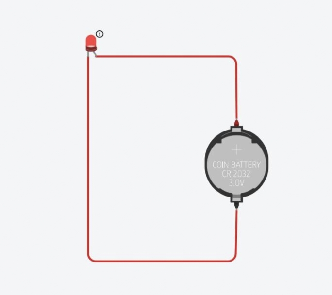
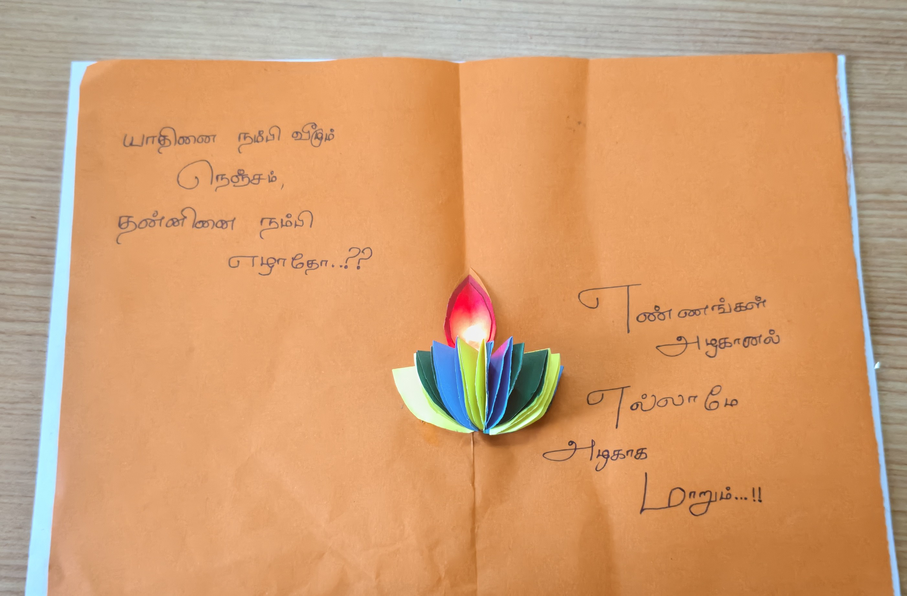

**GREETING LIGHTS**

**DESCRIPTION**:   
 		A Simple paper made greeting card and it is constructed by           
basic electric component

**REQUIRED MATERIAL:**

    * A4 paper/ card paper  
    * Colour paper  
    * Scale  
    * Scissors  
    * Colour pens  
    * Glue  
    * Small LED light   
    * Aluminium foil paper  
    * Cello tape  
    * Battey 3v  
      

**PROCEDURE**

* Select the required card paper.  
* Measure and mark the folding line.  
* Fold the paper neatly in half.  
* Cut the colour papers into round shape  
* Cut and paste the coloured round shape papers.  
* Write some motivated lines and greeting quotes.  
* Add the LED and completete circuit .  
* Check the final card for proper finishing.

**NOTES**

* the measurements and fold accurate.  
* Cut the paper carefully.    
* The LED light was connected according to the positive (+) and negative (-) terminals.  
* The positive terminal was connected to the positive side of the power source.Keeps   
* The negative terminal was connected to the negative side.  
* The correct polarity was checked to make sure the LED light properly.  
* The connections were secured using cello tape.

**CIRCUIT DIAGRAM**  
 
**PROJECT**

